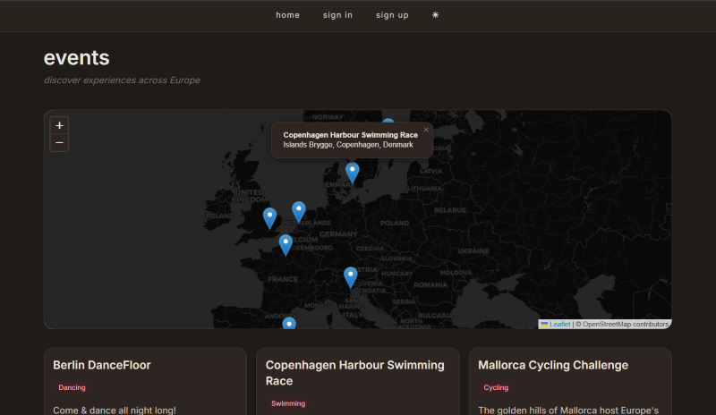
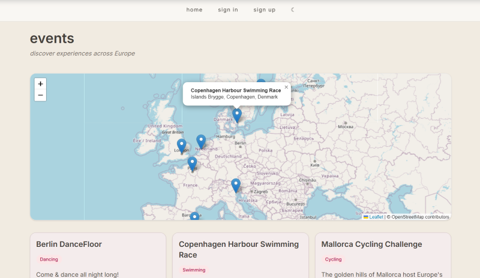

### EventBeat

*A full-stack event discovery platform for exploring and managing events across Europe (for now).*

The React frontend communicates with a REST API built with Express and TypeScript. The backend uses Mongoose to interact with MongoDB Atlas. Event data is returned as JSON and rendered as interactive map markers and event cards in the frontend.

#### Frontend
- React
- Vite
- Leaflet
- CSS

#### Backend
- Node.js
- Express
- TypeScript
- MongoDB Atlas
- Mongoose

Features: *Browse events on an interactive Leaflet map, View event details, Create new events, Edit existing events, Delete events, User authentication (when completed), Dark/Light theme, Responsive layout.*



*figure 1. dark-theme*

## Start React app - Frontend: 

`npm create vite@latest events`

###### choose

`React`

`JavaScript`

##### run
`cd events`

`npm install`

`npm run dev`

`npm install tailwindcss @tailwindcss/vite`


#### project's structure

```text
eventBeat/
├── src/                 -> React + Vite frontend
│   ├── components/
│   ├── pages/
│   ├── config/
│   └── assets/
│
├── backend/
│   ├── src/             -> Express + TypeScript backend
│   │   ├── controllers/
│   │   ├── models/
│   │   ├── routes/
│   │   ├── dbinit.ts
│   │   └── server.ts
│   ├── package.json
│   └── tsconfig.json
│
├── package.json         
└── README.md
```


## Backend setup

`cd backend`

`npm init -y`

`npm install express cors mongoose`

`npm install -D typescript @types/node @types/express @types/cors`

#### to deploy

`build command: npm install && npm run build`

`start command: npm start`

#### in backend/package.json

#### change/add

`"start": "node dist/server.js"`

*tsc compiles to dist*

*start runs compiled JS*





*figure 2. light-theme*
